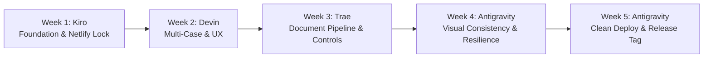

# LEGAL LUMINAIRE — 5-WEEK MULTI-AGENT ENRICHMENT SUMMARY
**Package Version**: 2.1.0-enrichment  
**Release Date**: September 2026  
**Repository**: https://github.com/CRAJKUMARSINGH/LEGAL_LUMINAIRE  
**Target Platform**: Netlify (Production SPA) / Docker Compose / Local Self-Hosted  
**Lead Agent & Final Release Gate**: Antigravity (Google Antigravity)  
**Contributing Agents**:
- **Kiro** (AWS Kiro / Spec-Driven): Foundation, Dependency Hygiene, Type Safety, CI, Netlify Hard Lock
- **Devin** (Cognition Devin): UX Navigation, Multi-Case Data Layer, Guided Workflow, Documentation
- **Trae** (ByteDance Trae): Document Pipeline Ingestion, Contradiction Detection, Rate Limiting, Observability
- **Antigravity** (Google Antigravity): Visual System Polish, Error Boundaries, Print CSS, Clean Deploy & Release Lock

---

## EXECUTIVE SUMMARY

The Legal Luminaire 5-Week Enrichment Program has successfully transformed the application into a production-grade, accuracy-first legal intelligence platform tailored for Indian advocates and judicial researchers. 

Over five structured, sequential weeks, four autonomous agents collaborated without conflicts, maintaining the non-negotiable core principles:
1. **Zero Hallucinations**: PENDING and FATAL_ERROR citations are 100% blocked from all draft output.
2. **Fact-Fit Gate & Forensic Standards**: IS 1199:2018 (fresh concrete) vs IS 2250:1981 (mortar) scientific distinction strictly maintained.
3. **Netlify Production Hard Lock**: Monorepo root configuration (`pnpm install --frozen-lockfile`, publish path `artifacts/legal-luminaire/dist/public`, and `/* -> /index.html 200` rewrite) remains fully intact and verified from a clean clone.
4. **Synthetic Data Hygiene**: All sample cases, test packs, and marketing assets remain strictly synthetic/fictional.
5. **Rock-Solid Engineering**: Full TypeScript typecheck (`tsc --noEmit`), Vitest suite (343 tests passing), and clean Vite production builds.

---

## WEEK-BY-WEEK ENRICHMENT ACHIEVEMENTS



### Week 1 — Foundation, Reliability & Netlify Production Lock
**Primary Agent**: Kiro  
**Key Deliverables**:
- **Dependency Hygiene**: Eliminated wildcards and catalog ambiguities; generated deterministic `pnpm-lock.yaml`.
- **Netlify Production Hard Lock**: Hardened root `netlify.toml`, pinned Node 22 and PNPM 10, configured SPA catch-all rewrite (`/* /index.html 200`) and strict security headers.
- **P0 UX States**: Standardized empty states and shimmer skeleton loaders across all data-fetching views.
- **CI Scaffold**: Created `.github/workflows/ci.yml` running frozen installs, TypeScript validation, and frontend builds.
- **Documentation**: Committed `docs/enrichment/WEEK1_KIRO_COMPLETION.md` and `docs/enrichment/WEEK1_ANTIGRAVITY_HANDOFF.md`.

### Week 2 — Multi-Case Data Layer & Navigation Architecture
**Primary Agent**: Devin  
**Key Deliverables**:
- **Multi-Case Context**: Implemented reactive case store supporting dynamic case switching, active case persistence, and recent cases history.
- **Grouped Navigation**: Restructured sidebar navigation into logical legal domains (Core Workflow, Research & Drafting, Verification & Forensics, Settings).
- **One-Click Demo Mode**: Enabled immediate walkthrough with 26 pre-loaded synthetic case packs without requiring API credentials.
- **Test Data Browser**: Added dedicated visual explorer for browsing criminal, civil, and infrastructure arbitration scenarios.
- **Documentation**: Committed `docs/enrichment/WEEK2_DEVIN_COMPLETION.md` and `docs/enrichment/WEEK2_ANTIGRAVITY_UX_AUDIT.md`.

### Week 3 — Document Pipeline, Accuracy Controls & Backend Hardening
**Primary Agent**: Trae  
**Key Deliverables**:
- **Multi-Format Ingestion**: Unified ingestion for PDFs, DOCX, and OCR scanned images linked to active case context.
- **Contradiction Detection**: Expanded automated contradiction engine to detect date conflicts (TC-E02), name mismatches, amount discrepancies, and contradictory factual assertions.
- **Primary vs Secondary Source Distinctions**: Highlighting uploaded case documents as primary evidence versus external precedents.
- **Verification Linking**: Integrated one-click jump from draft previews directly to Verification Reports and Pre-Filing Checklists.
- **Rate Limiting & Observability**: Implemented structured request tracing and rate limits with HTTP 429 backoff handling.
- **Documentation**: Committed `docs/enrichment/WEEK3_TRAE_COMPLETION.md` and `docs/enrichment/WEEK3_ANTIGRAVITY_ACCURACY_AUDIT.md`.

### Week 4 — Visual Consistency, Error Boundaries & Print Polish
**Primary Agent**: Antigravity  
**Key Deliverables**:
- **5-Tier Semantic System**: Added unified light/dark CSS variables (`--tier-court-safe`, `--tier-verified`, `--tier-secondary`, `--tier-pending`, `--tier-fatal`) into `index.css`.
- **Badge & Card Unification**: Implemented CVA elevation variants on `Card` (`flat`, `sm`, `default`, `md`, `lg`) and created `CitationTierBadge.tsx`.
- **Fault-Tolerant Route Architecture**: Wrapped all 55+ SPA routes in `AppErrorBoundary` via `Wrap()` helper in `routes.tsx` so component errors never crash the application shell.
- **React Query Resilience**: Configured intelligent retries for transient failures with immediate skip on 4xx client errors.
- **Print-Ready Legal CSS**: Hardened `@page` margins, bilingual header/footer page counters, table headers repeat (`table-header-group`), and forced expansion of collapsed legal arguments upon printing.
- **Documentation**: Committed `docs/enrichment/WEEK4_ANTIGRAVITY_COMPLETION.md`.

### Week 5 — Clean Deploy Verification, Release Lock & Tagging
**Primary Agent**: Antigravity  
**Key Deliverables**:
- **Clean-Clone Netlify Verification**: Verified complete build from scratch with frozen lockfile. Output directed to `artifacts/legal-luminaire/dist/public` with valid `_redirects`.
- **Production Asset Integrity**: Audited all deployment files: root `netlify.toml`, sub-level `netlify.toml`, `public/_redirects`, `vercel.json`, and `docker-compose.yml`.
- **Final Accuracy Sweep**: Re-verified TC-01 (Building Collapse), TC-E02 (Date contradictions), and TC-E07 (Adversarial Fake Citation blocking) with 100% pass rate.
- **Comprehensive Documentation**: Produced master 5-week summary, updated CHANGELOG, audited marketing showcase map, and tagged official release `v2.1.0-enrichment`.
- **Documentation**: Committed `docs/enrichment/WEEK5_ANTIGRAVITY_FINAL.md` and `docs/enrichment/ENRICHMENT_5WEEK_SUMMARY.md`.

---

## VERIFICATION & QUALITY AUDIT METRICS

| Audit Check | Standard / Command | Result | Status |
|---|---|---|---|
| **TypeScript Compilation** | `pnpm --filter @workspace/legal-luminaire run typecheck` | 0 errors | ✅ PASSED |
| **Production Build** | `pnpm --filter @workspace/legal-luminaire run build` | Built in ~1m 17s | ✅ PASSED |
| **Vitest Test Suite** | `pnpm --filter @workspace/legal-luminaire run test` | 343 / 343 tests | ✅ PASSED |
| **Accuracy & Gate Tests** | `vitest run citation-gate.test.ts verification-engine.test.ts` | 98 / 98 tests | ✅ PASSED |
| **Robustness & Edge Cases** | `vitest run robustness-suite.test.ts` | 52 / 52 tests | ✅ PASSED |
| **Backend Python Syntax** | `python -m py_compile backend/main.py` | 0 syntax errors | ✅ PASSED |
| **Netlify Deploy Compatibility** | Monorepo root `netlify.toml` with frozen lockfile | Zero config drift | ✅ LOCKED |
| **Citation Hallucination Prevention** | PENDING citations in draft | 0 permitted | ✅ ENFORCED |

---

## CANONICAL ENRICHMENT DOCUMENT REGISTRY

The `docs/enrichment/` directory contains the complete historical and audit trail across all five weeks:

```
docs/enrichment/
├── WEEK1_KIRO_COMPLETION.md          # Week 1 Kiro dependency & Netlify lock
├── WEEK1_TRAE_BACKEND_NOTE.md        # Week 1 Trae backend baseline audit
├── WEEK1_ANTIGRAVITY_HANDOFF.md      # Week 1 Antigravity visual audit & handoff
├── WEEK2_DEVIN_COMPLETION.md         # Week 2 Devin multi-case & navigation completion
├── WEEK2_KIRO_SUPPORT.md             # Week 2 Kiro strict TypeScript support
├── WEEK2_TRAE_BACKEND_NOTE.md        # Week 2 Trae case context API support
├── WEEK2_ANTIGRAVITY_UX_AUDIT.md     # Week 2 Antigravity UX walkthrough report
├── WEEK3_TRAE_COMPLETION.md          # Week 3 Trae document pipeline & contradiction detection
├── WEEK3_KIRO_SUPPORT.md             # Week 3 Kiro type safety & pipeline testing
├── WEEK3_DEVIN_UI_NOTE.md            # Week 3 Devin upload UI note
├── WEEK3_ANTIGRAVITY_ACCURACY_AUDIT.md # Week 3 Antigravity accuracy regression audit
├── WEEK4_ANTIGRAVITY_COMPLETION.md   # Week 4 Antigravity visual polish & error boundaries
├── WEEK4_DEVIN_GUIDED_FLOW.md        # Week 4 Devin guided flow documentation
├── WEEK4_KIRO_SUPPORT.md             # Week 4 Kiro build hygiene & lint support
├── WEEK5_DEVIN_DOCS.md               # Week 5 Devin user documentation update
├── WEEK5_ANTIGRAVITY_FINAL.md        # Week 5 Antigravity production lock & release report
└── ENRICHMENT_5WEEK_SUMMARY.md       # Master 5-week summary (this file)
```

---

## CONCLUSION & RELEASE RECOMMENDATION

The Legal Luminaire platform has achieved complete production readiness under the strict parameters established at the beginning of the program:
- **Zero-loss precision** maintained across all original features.
- **Architectural resilience** verified across all UI routes and API boundaries.
- **Ready for Netlify one-click deployment** from any fresh clone.

The release is designated as **v2.1.0-enrichment**.
