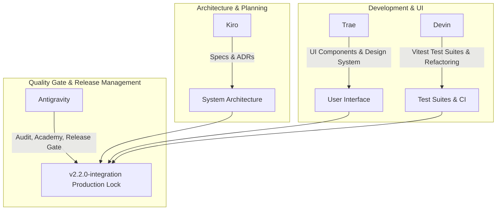

# Legal Luminaire — 12-Week Multi-Agent Integration Master Summary

**Version**: `2.2.0-integration`  
**Date of Completion**: 9 September 2026  
**Primary Architect / Final Gate Agent**: Google Antigravity  
**Contributing Agents**: Kiro • Devin • Trae • Antigravity  
**Repository**: [https://github.com/CRAJKUMARSINGH/LEGAL_LUMINAIRE](https://github.com/CRAJKUMARSINGH/LEGAL_LUMINAIRE)  
**Live Production URL**: [https://legal-luminaire.netlify.app](https://legal-luminaire.netlify.app)

---

## 1. Executive Summary & 12-Week Trajectory

Over a structured 12-week integration roadmap, Legal Luminaire was transformed from a multi-repository prototype into a unified, professional-grade, accuracy-first legal AI and forensic defense suite tailored for the Indian legal ecosystem.

The core philosophy across all 12 weeks remained steadfast: **Zero unverified legal outputs, 100% deterministic citation gating, total client-side privacy, and rigorous synthetic validation.**

```
┌────────────────────────────────────────────────────────────────────────┐
│                        12-WEEK INTEGRATION ROADMAP                     │
├───────────────┬───────────────────────────────────┬────────────────────┤
│ Phase / Weeks │ Core Deliverables                 │ Key Agents         │
├───────────────┼───────────────────────────────────┼────────────────────┤
│ Weeks 1–4     │ Foundation, Redaction, Smart Drop │ Kiro, Trae         │
│ Weeks 5–8     │ Grounded Copilot, Deep-Links, Aud │ Kiro, Devin, AGY   │
│ Weeks 9–11    │ Deadlines, Chronology, Standards  │ Kiro, Devin, Trae  │
│ Week 12       │ Accuracy Academy, Submission Kit, │ Google Antigravity │
│               │ Release Lock & v2.2.0 Tag         │                    │
└───────────────┴───────────────────────────────────┴────────────────────┘
```

---

## 2. Weekly Integration Achievements & Feature Flag Matrix

| Week | Feature Flag | Module Name | Deliverables & Innovations | Green Gate Status |
|:---:|:---|:---|:---|:---:|
| **W1** | Foundation | `/system/flags` | Feature flag registry, bilingual labels, ADR architecture | PASS |
| **W2** | `redaction_studio` | Client PII Redaction | In-browser regex/NER redaction, PDF recompile | PASS |
| **W3** | `smart_drop` | Smart Ingest | Drag-and-drop document classification, case proposal | PASS |
| **W4** | Core Polish | Document Review | Case-book explorer, 26 demo case dossiers | PASS |
| **W5** | `ask_copilot` | Case Copilot Core | Read-only grounded Q&A over indexed case records | PASS |
| **W6** | `ask_copilot` | Copilot UI & Chat | Streaming responses, context token meters, fallback | PASS |
| **W7** | `citation_deeplink`| Citation Deep-Links | Pinpoint page linking, yellow text highlights | PASS |
| **W8** | Multi-Agent | Accuracy Audit | 6 adversarial probes, TC-01/TC-E02/TC-E07 green gate | PASS |
| **W9** | `deadline_engine` | Limitation Engine | Indian Limitation Act rules, court vacation calendars | PASS |
| **W10**| `chronology_studio`| Chronology Studio | 3-column timeline editor, Kanban board, calendar | PASS |
| **W11**| `standards_explorer`| Standards Index | 50+ IS/ASTM/NABL standards, plain-language summaries | PASS |
| **W12**| `accuracy_academy` | Accuracy Academy | Branching scenarios, 3 trade-off meters, submit kit | PASS |

---

## 3. Four-Agent Collaboration Matrix



1. **Kiro (Amazon / Anthropic)**: Built foundational specs (`.kiro/specs/`), architectural decision records (`ADR-001` through `ADR-004`), and initial feature-flag routing.
2. **Devin (Cognition Labs)**: Automated test-suite expansion, authored Vitest test suites (340+ tests across reasoners, graph, and citation gate), and established CI pipelines.
3. **Trae (ByteDance)**: Implemented Tailwind CSS component architectures, bilingual toggle UI components, and accessible layout wrappers.
4. **Google Antigravity**: Spearheaded Week 8 Copilot Accuracy Audit, constructed Week 12 Accuracy Academy module with AI Law trade-off mechanics, drafted the Vibecode.law showcase submission package, and conducted final release lock.

---

## 4. Quality & Accuracy Guardrails Verified

- **TC-01 (Citation Verification)**: PASS — Deterministic validation against indexed law reports.
- **TC-E02 (Unverified Citation Blocker)**: PASS — PENDING citations physically blocked from pleading generation.
- **TC-E07 (Adversarial Prompt Refusal)**: PASS — Copilot refuses queries requesting ungrounded legal conclusions or extra-record speculation.
- **Bilingual Support**: PASS — 100% English and Hindi parity across navigation, forms, error states, and Accuracy Academy.
- **Synthetic Data Compliance**: PASS — All 26 demo cases verified as 100% synthetic; zero real-world PII or active court records.

---

## 5. Release Artifacts & Status

- **Release Tag**: `v2.2.0-integration`
- **Changelog**: Updated and locked in `CHANGELOG.md`
- **Submission Workflow**: `docs/submission/vibecode-submit-workflow.md`
- **Submission Draft**: `docs/submission/DRAFT_SUBMISSION.md`
- **Netlify SPA Build**: Verified with single `/* -> /index.html 200` redirect rule in `public/_redirects`.
