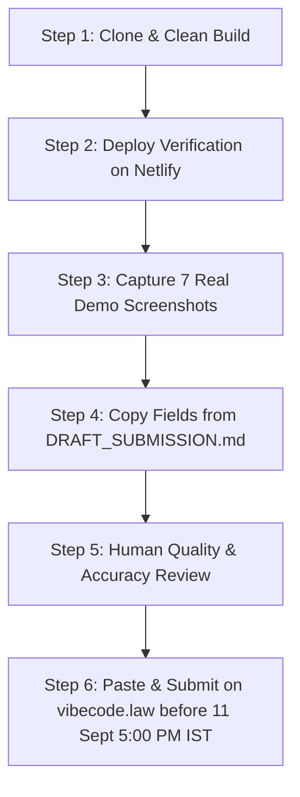

# Vibecode.law Showcase Submission Workflow & Operator Playbook

**Project**: Legal Luminaire — Accuracy-First Indian Legal AI & Forensic Defense Suite  
**Submission Portal**: [vibecode.law/showcase](https://vibecode.law/showcase)  
**Strict Human-Submission Deadline**: **11 September 2026, 5:00 PM IST**  
**Workflow Pattern Adopted**: `vibecode-submit` skill mechanic — *The agent drafts every field and checklist from the codebase; the human operator reviews, captures live demo screenshots, pastes into the submission form, and submits.* **The agent NEVER auto-submits, and NEVER fabricates imagery.**

---

## 1. Operating Rules & Guardrails

1. **Human-in-the-Loop Gate**: All submissions must be reviewed, finalized, and submitted by a human operator. The AI agent generates paste-ready markdown and checklists only.
2. **Real Captures Only**: All screenshots must be taken from the live Netlify production deployment or a clean local production build. No mockups, placeholders, or fabricated images.
3. **Accuracy Disclosures**: The AI-assisted development disclosure table must transparently credit all four agents (Kiro, Devin, Trae, Antigravity) alongside human architecture and legal domain direction.
4. **Synthetic Data Rule**: Confirm all case names, court numbers, FIR details, and dates displayed in public materials are 100% synthetic.

---

## 2. Step-by-Step Submission Procedure



### Step 1: Clone & Production Verification
Run a fresh verification to confirm clean build:
```bash
git clone https://github.com/CRAJKUMARSINGH/LEGAL_LUMINAIRE.git
cd LEGAL_LUMINAIRE
pnpm install
pnpm build
pnpm test
```

### Step 2: Live Demo Sanity Check
Ensure all routes load cleanly without 404s (SPA redirects active):
- `https://legal-luminaire.netlify.app/` (Home)
- `https://legal-luminaire.netlify.app/demo-browser` (26 Demo Cases)
- `https://legal-luminaire.netlify.app/copilot` (Grounded Copilot with Citations)
- `https://legal-luminaire.netlify.app/case/demo-1/chronology` (Chronology Studio)
- `https://legal-luminaire.netlify.app/case/demo-1/deadlines` (Deadline Board & Calendar)
- `https://legal-luminaire.netlify.app/standards-index` (Standards Explorer)
- `https://legal-luminaire.netlify.app/academy` (Accuracy Academy)

### Step 3: Real Screenshot Capture Checklist
Take high-resolution PNG captures (1920x1080) of the live application for each designated view:

| # | Artifact Name | Live Route / View | What to Capture |
|---|---|---|---|
| 1 | `01_home_dashboard.png` | `/` | Dynamic case overview, quick stats, bilingual switch |
| 2 | `02_smart_drop_ingest.png` | `/new-case-ingest` | Document drop classification, metadata proposal preview |
| 3 | `03_grounded_copilot_citations.png` | `/copilot` | Copilot response with yellow pinpoint deep-links & Fact-Fit badge |
| 4 | `04_chronology_studio.png` | `/case/demo-1/chronology` | Three-column event timeline with source document links |
| 5 | `05_deadline_board.png` | `/case/demo-1/deadlines` | Kanban limitation cards with urgent countdown badges |
| 6 | `06_standards_explorer.png` | `/standards-index` | IS/NABL standards browser with plain-language defense summary |
| 7 | `07_accuracy_academy.png` | `/academy` | Live trade-off meters, branching scenario card, cost breakdown |

*Save these files into `docs/submission/screenshots/`.*

### Step 4: Copy Form Fields from DRAFT_SUBMISSION.md
Open `docs/submission/DRAFT_SUBMISSION.md` and copy each section directly into the corresponding vibecode.law form inputs:
- Project Title
- One-line Pitch
- 200-Word Summary
- Core Capabilities & Innovations
- AI Disclosure Table
- Practice Area Tags
- GitHub Repository URL & Live Netlify URL

### Step 5: Final Review & Submission
1. Review all form fields for formatting.
2. Upload the 7 real screenshots.
3. Click **Submit Project** on [vibecode.law/showcase](https://vibecode.law/showcase) before **11 September 2026, 5:00 PM IST**.
4. Confirm submission receipt and archive the submission URL into `docs/submission/SUBMISSION_RECEIPT.md`.
